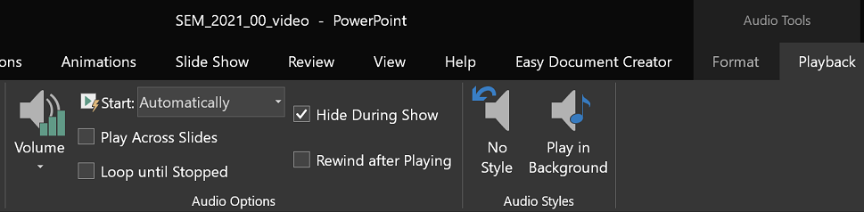
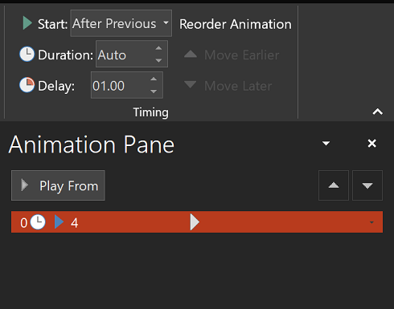
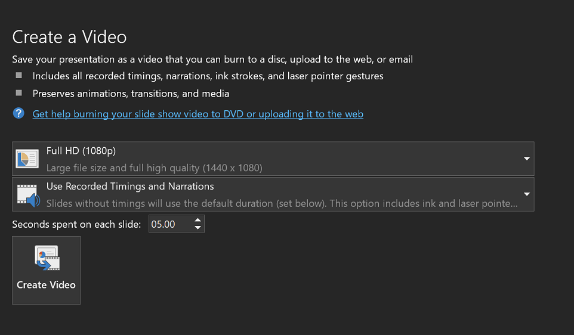

# Text-to-Speech utility for teaching

Synthesized voice for your video presentation, using MS Azure Speech Services.

## Get started

The following steps should be performed to prepare your system.

1. Install `python` and `pip`, if they are not already installed. Follow the platform specific installation instructions.

1. Clone or download this repository from Github: https://github.com/babaknaderi/tts_for_teaching , e.g.

    ```bash
    git clone https://github.com/babaknaderi/tts_for_teaching
    cd tts_for_teaching
    ```

1. Install the python module dependencies in `requirements.txt` using `pip`

    ```bash
    pip install -r requirements.txt
    ```

1. Get an Azure Key and Region. Follow [this link](https://docs.microsoft.com/en-us/azure/cognitive-services/speech-service/overview) for more details. You can use the free trial and that will be enough.

1. Add the keys in the `azure_tts\key.cfg`.


   ```INI
    [speech_service_key]
    speech_key:YourSubscriptionKey
    service_region:YourServiceRegion
   ```
    
## Try it out
Run the following command to try it out: 

   ```bash
    python azure_tts\azure_tts_create_audio.py --input_dir sample_text --out_dir output
   ```

`input_dir` the directory contain all SSML files

`out_dir` a wave will be created per each SSML file and stored in this directory


## Create your SSML files
For each slide create one SSML file and store it in a directory 'group_[GROUP_number]'

You can specifiy the voice and style of it in the SSML file. We will use "ChristopherNeural" voice. You can listen to that [here](https://azure.microsoft.com/en-us/services/cognitive-services/text-to-speech/#features) after setting the properties in the right-hand side.
To make sure your text follow the same structure, then the SSML file should have the following header/footer:


   ```xml
    <speak xmlns="http://www.w3.org/2001/10/synthesis" xmlns:mstts="http://www.w3.org/2001/mstts" xmlns:emo="http://www.w3.org/2009/10/emotionml" version="1.0" xml:lang="en-US">
        <voice name="en-US-ChristopherNeural">
            <prosody rate="0%" pitch="0%">    
            
<p>Welcome to the Applied Statistics For HCI seminar. <s>In this seminar we focus on how to apply specific statistical methods to important research questions regarding perceived quality.</s></p>

<p><s>We focus on following statistical methods:</s> 
<break/>
Data Cleansing,<break/> Visualization,<break/> Correlation, <break/> Regression, <break/>Factor Analysis, <break/> Hypothesis Testing,<break/> Mixed Effect Models, <break/>Non-parametric tests, <break/>Clustering and Classification,<break/> Moderation, <break/>Mediation, <break/>Reliability analysis,<break/> and Structural Equation Modeling.</p>


            </prosody>            
        </voice>
     </speak>
   ```
 
You can find lots of information [about SSML here](https://docs.microsoft.com/en-us/azure/cognitive-services/speech-service/speech-synthesis-markup?tabs=csharp)
You should add _pause_/_break_ or _silence, specify _paragraphs_, and _sentences_. 
There are also lot more that you can do, to create a natural and well spoken text. **That will increase the value of your
presentation and distinguishes excellent works from others.**
 
## How to merge wave and videos
Here is a step-by-step how to:

1. Prepare all your slides with animations and all extras you wish to have.

2. Follow the above procedure and create a wave file per each slide.

3. Add the corresponding wav file to each slide:
    
    1. In PowerPoint, go to **Insert** > **Media** > **Audio** > **Audion on my PC..**. 
    Select the wave file for this slide.
    
    1.  From **Playback** setting, select **Start Automatically**:
    
    
    
    1.  From **Animations** select **Animation Pane**, select the animation correspond to the audio clip, 
    and add **1 second delay**:
    
    
    
4. Start recording: go to **Slide Show** > **Record Slide Show**.
    
    1.  Make sure to remove all previous recordings (when you want to re-record specific page), you can just clear that one.
    For that you should clear all timings and narrations.
    
    1. Click on the **Record**. The recording starts, the wave file will be played, click on the page when your animation should be played.
    Go to the next page when the audio clip finished.
    
    1.  Save the file. You should deliver this ppt file. 
    
5.  Export the video:
    
    1. Go to **File** > **Export** > **Create a Video** . Make sure the configuration is as following:
    
    
    
    1.  When finished, use FFMPEG to reduce the file size:
     
    ```bash
    ffmpeg -i group_X_topic_Y.mp4 -crf 24 output.mp4
    ```
     
       
